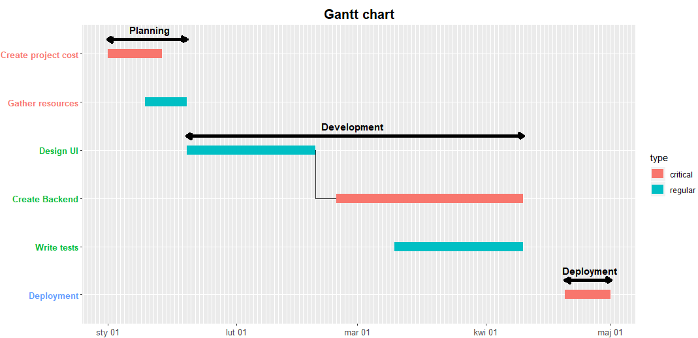
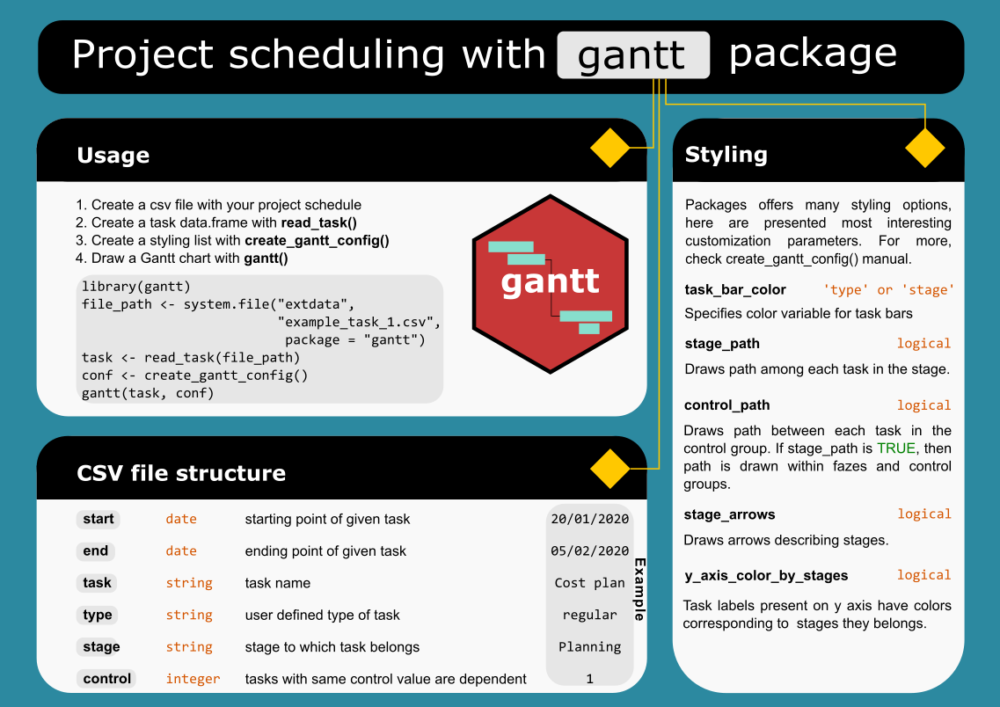

# gantt 

Gantt is a R package created to fast and easy designing Gantt chart for your projects. It allows you to customize it with different options like creating paths, changing colors and sizes. Package is still in development so more powerful customization options will be added in next releases.

## Installing

    # install.packages("devtools")
    devtools::install_github("piotr-ole/gantt")
    
## Usage

Package usage is very simple. Drawing a Gantt chart follows four steps:
* Create a csv file with your project schedule
* Create a task data.frame with read_task function
* Create a styling configuration list with create_gantt_config function
* Draw a Gantt chart with gantt function where task data.frame and styling list are parameters

## Creating CSV file with tasks

Task file should contain following columns
* `start` date when given task starts
* `end` date when given task ends
* `task` name of task
* `type` string denoting task type
* `stage` string describing stage to which task belongs
* `control` integer saying which tasks are dependent of each other (same value means dependance)

## Example

There is an example csv file task within the package

    library(gantt)
    file_path <- system.file("extdata", "example_task_1.csv", package = "gantt")
    task <- read_task(file_path)
    conf <- create_gantt_config()
    gantt(task, conf)

You can view example file structure from R with 

    View(read.csv(file_path, sep = ';'))
    
## Cheatsheet

